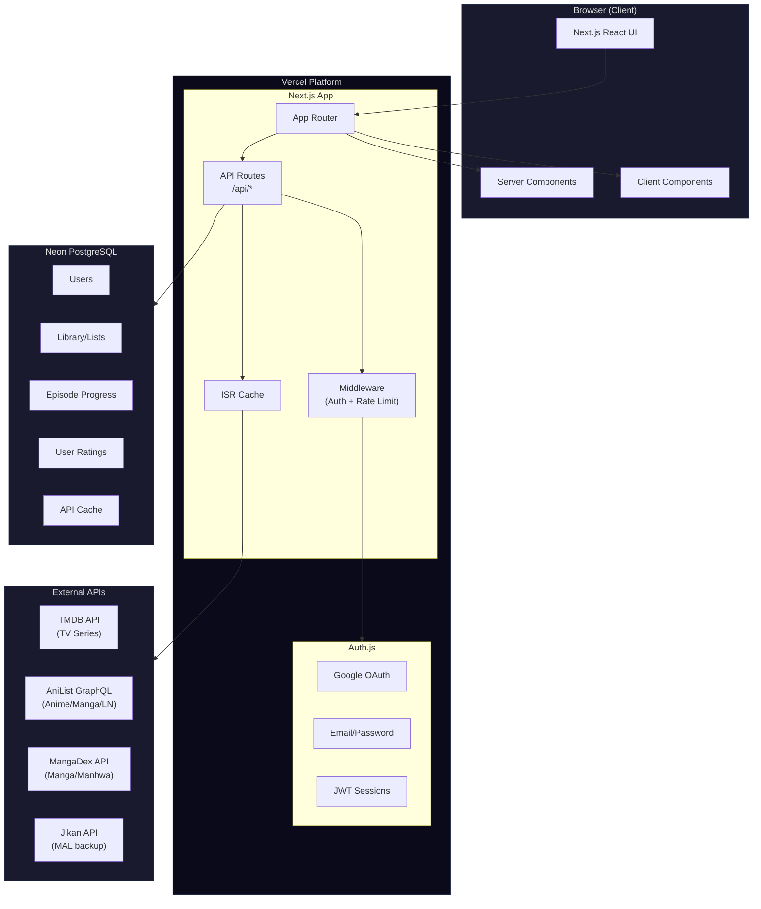
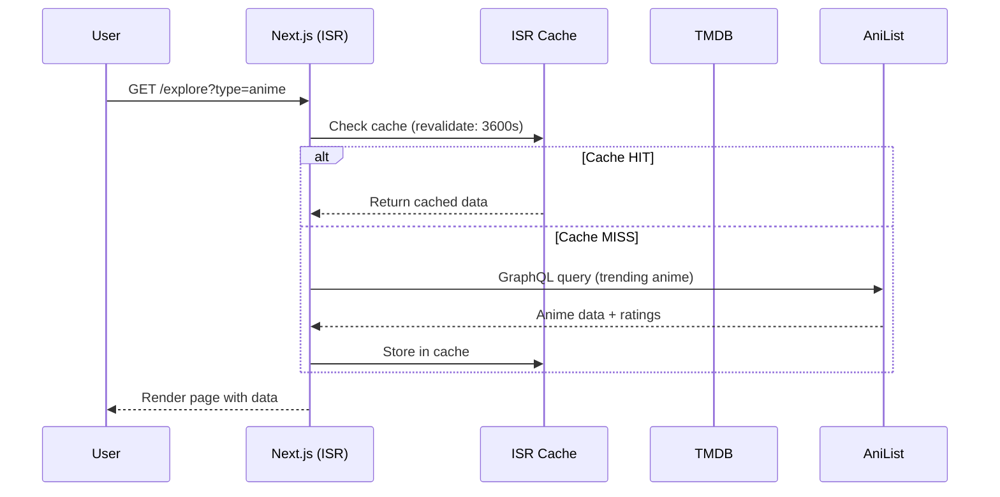
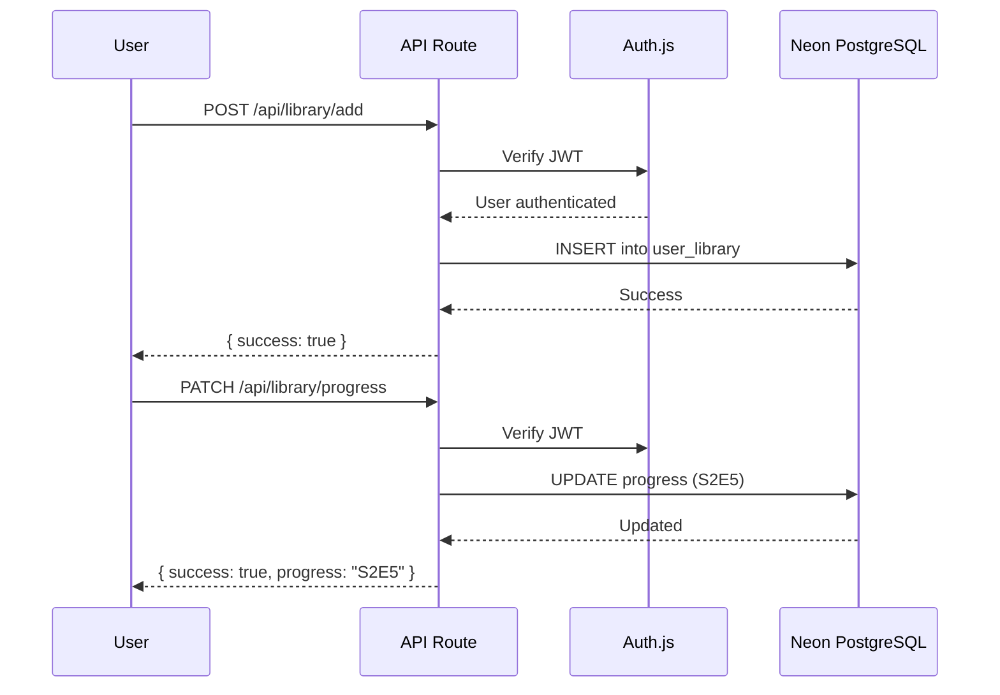

# System Architecture — Free Serie Tracker

## High-Level Architecture



## Data Flow

### 1. Series Discovery (Home/Explore)



### 2. Add to Library & Track Progress



## Layered Architecture

```
┌─────────────────────────────────────────────────┐
│                  Presentation Layer              │
│   (React Components, Server/Client Components)   │
├─────────────────────────────────────────────────┤
│                  API Layer                       │
│   (Next.js API Routes — /app/api/*)              │
├─────────────────────────────────────────────────┤
│                  Service Layer                   │
│   (Business Logic — /lib/services/*)             │
├─────────────────────────────────────────────────┤
│                  Data Access Layer               │
│   ┌──────────────┐  ┌────────────────────┐      │
│   │ Prisma ORM   │  │ External API       │      │
│   │ (PostgreSQL)  │  │ Clients            │      │
│   │              │  │ (TMDB, AniList,    │      │
│   │              │  │  MangaDex, Jikan)   │      │
│   └──────────────┘  └────────────────────┘      │
├─────────────────────────────────────────────────┤
│                  Infrastructure                  │
│   (Auth.js, Middleware, Rate Limiting, Caching)  │
└─────────────────────────────────────────────────┘
```

## Content Type Module System

Each content type is handled as a modular service:

```typescript
// lib/services/content/types.ts
interface ContentProvider {
  type: ContentType;
  search(query: string): Promise<SeriesResult[]>;
  getDetails(externalId: string): Promise<SeriesDetail>;
  getTrending(): Promise<SeriesResult[]>;
  getPlatforms(externalId: string): Promise<Platform[]>;
  getRatings(externalId: string): Promise<Rating[]>;
}

// lib/services/content/tv-provider.ts    → TMDB
// lib/services/content/anime-provider.ts → AniList + Jikan
// lib/services/content/manga-provider.ts → AniList + MangaDex
// lib/services/content/novel-provider.ts → AniList
```

## Caching Strategy

| Data Type | Cache Duration | Strategy |
|---|---|---|
| Trending lists | 1 hour | ISR revalidate |
| Series detail | 24 hours | ISR revalidate |
| Platform availability | 12 hours | ISR revalidate |
| Search results | 30 minutes | ISR revalidate |
| User library | Real-time | No cache (DB direct) |
| User progress | Real-time | No cache (DB direct) |

## Rate Limiting Strategy

| Endpoint | Limit | Window |
|---|---|---|
| `/api/auth/login` | 5 requests | 15 minutes |
| `/api/auth/register` | 3 requests | 1 hour |
| `/api/search` | 30 requests | 1 minute |
| `/api/library/*` | 60 requests | 1 minute |
| General API | 100 requests | 1 minute |

## Error Handling Pattern

```typescript
// Consistent API response format
interface ApiResponse<T> {
  success: boolean;
  data?: T;
  error?: {
    code: string;
    message: string;
  };
  meta?: {
    page: number;
    totalPages: number;
    totalItems: number;
  };
}
```
