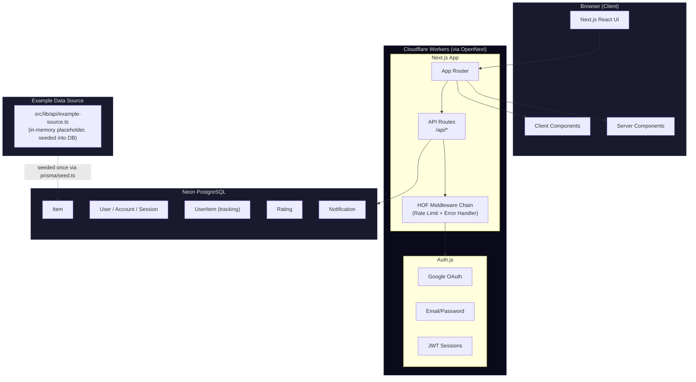
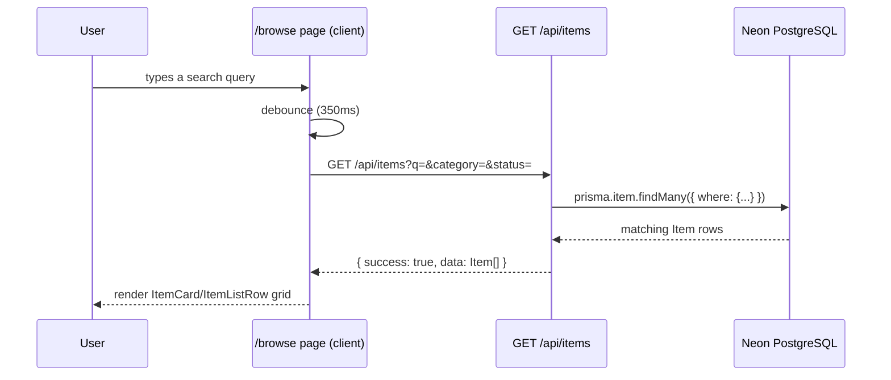
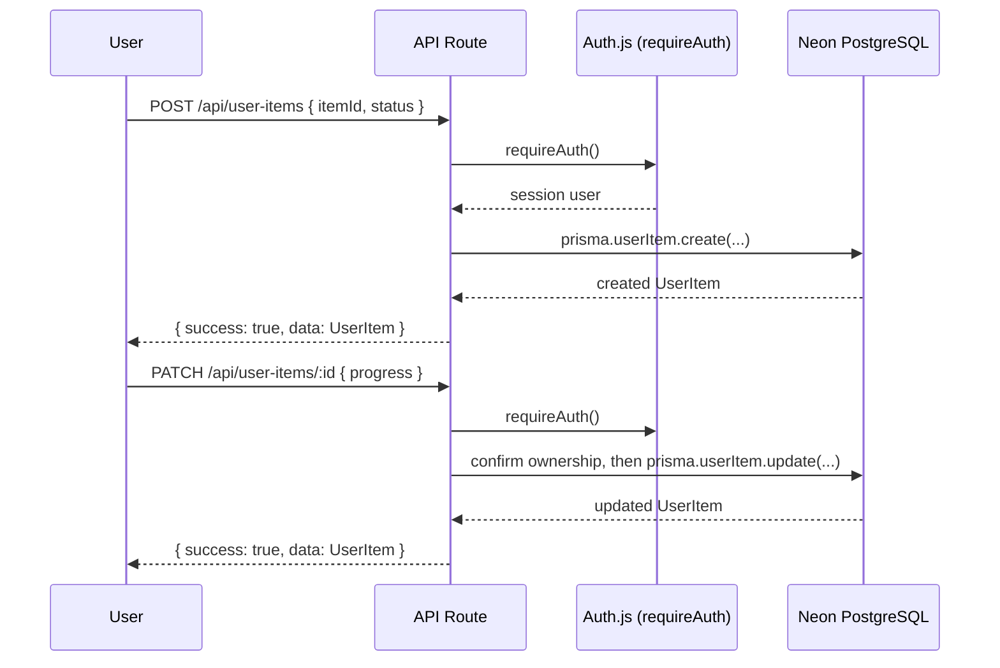

# System Architecture — Generic SaaS Starter

## High-Level Architecture



There is no service/repository/provider layer. Every API route queries Prisma directly — see [project-structure.md](project-structure.md) for the actual file layout and [design-patterns.md](design-patterns.md) for why this is a deliberate choice at this project's size, not an oversight.

## Data Flow

### 1. Browse / Search



No caching layer sits in front of this query — every request hits Postgres directly. At this project's scale (a handful of example rows) that's the right tradeoff; if you adapt this starter to a larger dataset, this is the place to add a cache.

### 2. Track an Item & Update Progress



Ownership is enforced in the route handler itself (`getOwnedUserItem()` in `src/app/api/user-items/[id]/route.ts`), not by a separate auth-guard middleware — a cross-user request gets a 404 (not 403), deliberately, so it doesn't leak whether the resource exists.

## Layered Architecture (as actually built)

```
┌─────────────────────────────────────────────────┐
│                  Presentation Layer              │
│   (React Server/Client Components — src/app/*)   │
├─────────────────────────────────────────────────┤
│                  API Layer                       │
│   (Next.js Route Handlers — src/app/api/*/route.ts)  │
│   Each handler does: parse → validate (Zod) →    │
│   query Prisma directly → format response.       │
│   No service or repository indirection.          │
├─────────────────────────────────────────────────┤
│                  Data Access                     │
│   Prisma ORM (src/lib/db/prisma.ts) — PostgreSQL │
├─────────────────────────────────────────────────┤
│                  Infrastructure                  │
│   Auth.js, HOF middleware (rate limit + error     │
│   handling), Zod validation schemas              │
└─────────────────────────────────────────────────┘
```

## Rate Limiting Strategy

Every route wrapped in `compose(withErrorHandler, withRateLimit)(handler)` gets the same uniform limit — `withRateLimit`'s defaults (`src/lib/utils/middleware.ts`), since no route currently overrides them:

| Limit | Window | Scope |
|---|---|---|
| 60 requests | 60 seconds | per IP (via `cf-connecting-ip` / `x-forwarded-for` header), per route path |

In-memory store, reset on redeploy — fine for a single Worker instance, not horizontally consistent across many instances. Swap for Cloudflare's native Rate Limiting or Upstash Redis if that matters for your deployment.

## Error Handling Pattern

```typescript
// The real, current ApiResponse<T> shape (src/types/common.ts)
interface ApiResponse<T> {
  success: boolean;
  data?: T;
  error?: string;
  message?: string;
}
```

`AppError` (`src/lib/utils/app-error.ts`) is a custom error class with factory statics (`AppError.notFound()`, `.unauthorized()`, `.forbidden()`, `.badRequest()`, `.conflict()`, `.validationError()`, `.rateLimited()`, `.externalApiError()`). Route handlers `throw` it; `withErrorHandler` (the outermost middleware in the `compose()` chain) catches it and converts it to a structured `errorResponse()` — anything that isn't an `AppError` is logged and returned as a generic 500, never leaking internals to the client.

See [design-patterns.md](design-patterns.md) for the full HOF middleware composition pattern and [api-contracts.md](api-contracts.md) for every endpoint's exact request/response shape.
