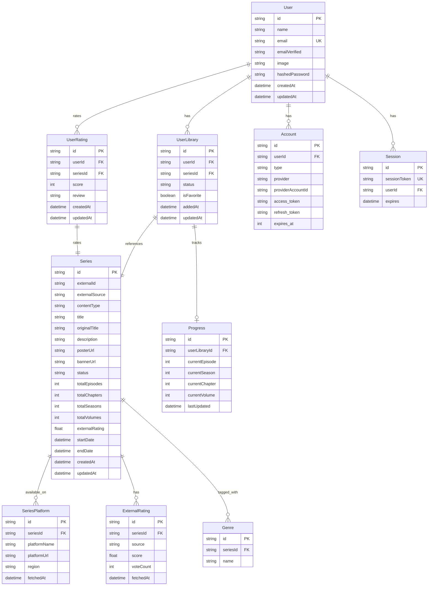

# Database Schema Design — Free Serie Tracker

## Entity Relationship Diagram



## Prisma Schema

```prisma
// prisma/schema.prisma

generator client {
  provider = "prisma-client-js"
}

datasource db {
  provider = "postgresql"
  url      = env("DATABASE_URL")
}

// ==================== AUTH MODELS (Auth.js) ====================

model User {
  id             String    @id @default(cuid())
  name           String?
  email          String    @unique
  emailVerified  DateTime?
  image          String?
  hashedPassword String?
  createdAt      DateTime  @default(now())
  updatedAt      DateTime  @updatedAt

  accounts    Account[]
  sessions    Session[]
  library     UserLibrary[]
  ratings     UserRating[]
}

model Account {
  id                String  @id @default(cuid())
  userId            String
  type              String
  provider          String
  providerAccountId String
  refresh_token     String? @db.Text
  access_token      String? @db.Text
  expires_at        Int?
  token_type        String?
  scope             String?
  id_token          String? @db.Text
  session_state     String?

  user User @relation(fields: [userId], references: [id], onDelete: Cascade)

  @@unique([provider, providerAccountId])
}

model Session {
  id           String   @id @default(cuid())
  sessionToken String   @unique
  userId       String
  expires      DateTime
  user         User     @relation(fields: [userId], references: [id], onDelete: Cascade)
}

model VerificationToken {
  identifier String
  token      String   @unique
  expires    DateTime

  @@unique([identifier, token])
}

// ==================== CONTENT MODELS ====================

enum ContentType {
  TV_SERIES
  ANIME
  MANGA
  MANHWA
  LIGHT_NOVEL
  WEBTOON
}

enum SeriesStatus {
  ONGOING
  COMPLETED
  UPCOMING
  HIATUS
  CANCELLED
}

model Series {
  id              String       @id @default(cuid())
  externalId      String       // ID from external API (TMDB, AniList, etc.)
  externalSource  String       // "tmdb", "anilist", "mangadex"
  contentType     ContentType
  title           String
  originalTitle   String?
  description     String?      @db.Text
  posterUrl       String?
  bannerUrl       String?
  status          SeriesStatus @default(ONGOING)
  totalEpisodes   Int?
  totalChapters   Int?
  totalSeasons    Int?
  totalVolumes    Int?
  startDate       DateTime?
  endDate         DateTime?
  createdAt       DateTime     @default(now())
  updatedAt       DateTime     @updatedAt

  genres          Genre[]
  platforms       SeriesPlatform[]
  externalRatings ExternalRating[]
  libraryEntries  UserLibrary[]
  userRatings     UserRating[]

  @@unique([externalId, externalSource])
  @@index([contentType])
  @@index([title])
}

model Genre {
  id       String @id @default(cuid())
  seriesId String
  name     String

  series Series @relation(fields: [seriesId], references: [id], onDelete: Cascade)

  @@index([name])
}

// ==================== PLATFORM AVAILABILITY ====================

model SeriesPlatform {
  id           String   @id @default(cuid())
  seriesId     String
  platformName String   // "Netflix", "Crunchyroll", "Disney+", etc.
  platformLogo String?  // URL to platform logo
  platformUrl  String?  // Deep link to content on platform
  region       String   @default("US") // Country code
  fetchedAt    DateTime @default(now())

  series Series @relation(fields: [seriesId], references: [id], onDelete: Cascade)

  @@index([seriesId])
  @@index([platformName])
}

// ==================== RATINGS ====================

model ExternalRating {
  id        String   @id @default(cuid())
  seriesId  String
  source    String   // "tmdb", "imdb", "anilist", "mal"
  score     Float    // Normalized to 0-10 scale
  voteCount Int      @default(0)
  fetchedAt DateTime @default(now())

  series Series @relation(fields: [seriesId], references: [id], onDelete: Cascade)

  @@unique([seriesId, source])
}

model UserRating {
  id        String   @id @default(cuid())
  userId    String
  seriesId  String
  score     Int      // 1-10
  review    String?  @db.Text
  createdAt DateTime @default(now())
  updatedAt DateTime @updatedAt

  user   User   @relation(fields: [userId], references: [id], onDelete: Cascade)
  series Series @relation(fields: [seriesId], references: [id], onDelete: Cascade)

  @@unique([userId, seriesId])
}

// ==================== USER LIBRARY ====================

enum LibraryStatus {
  WATCHING      // Currently watching/reading
  PLAN_TO_WATCH // Plan to watch/read
  COMPLETED     // Finished
  ON_HOLD       // Paused
  DROPPED       // Abandoned
}

model UserLibrary {
  id         String        @id @default(cuid())
  userId     String
  seriesId   String
  status     LibraryStatus @default(PLAN_TO_WATCH)
  isFavorite Boolean       @default(false)
  addedAt    DateTime      @default(now())
  updatedAt  DateTime      @updatedAt

  user     User      @relation(fields: [userId], references: [id], onDelete: Cascade)
  series   Series    @relation(fields: [seriesId], references: [id], onDelete: Cascade)
  progress Progress?

  @@unique([userId, seriesId])
  @@index([userId, status])
}

model Progress {
  id             String   @id @default(cuid())
  userLibraryId  String   @unique
  currentEpisode Int      @default(0)
  currentSeason  Int      @default(1)
  currentChapter Int      @default(0)
  currentVolume  Int      @default(1)
  lastUpdated    DateTime @default(now())

  library UserLibrary @relation(fields: [userLibraryId], references: [id], onDelete: Cascade)
}
```

## Indexes & Performance Notes

- **Series**: Indexed on `contentType` and `title` for fast filtering and search
- **UserLibrary**: Composite index on `[userId, status]` for efficient list queries
- **Genre**: Indexed on `name` for genre-based filtering
- **SeriesPlatform**: Indexed on `seriesId` and `platformName`
- **Unique constraints** prevent duplicate library entries and ratings per user/series

## Data Normalization Notes

- **Ratings**: All external ratings are normalized to a 0-10 scale
  - TMDB: Already 0-10
  - AniList: 0-100 → divide by 10
  - MAL: Already 0-10
  - IMDb: Already 0-10
- **Series deduplication**: `@@unique([externalId, externalSource])` prevents the same series from being stored twice from the same source
- **Progress tracking**: Single `Progress` model handles all content types. TV series uses `currentSeason` + `currentEpisode`, manga/manhwa uses `currentChapter`, light novels use `currentVolume` + `currentChapter`
