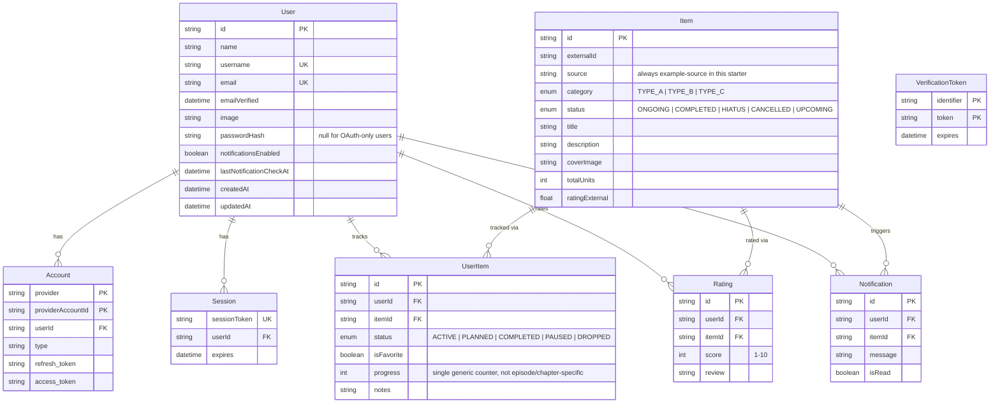

# Database Schema Design — Generic SaaS Starter

This document describes the database schema used by **Generic SaaS Starter** to store user accounts, authentication sessions, tracked items, personal tracking state, ratings, and notifications.

The schema is intentionally small and generic — `Item` carries no domain-specific fields (no episode counts, no platform availability, nothing TV/anime/manga-specific). Adapt `ItemCategory`'s three placeholder values (`TYPE_A`/`TYPE_B`/`TYPE_C`) to your real domain's categories when you build on this starter.

---

## Entity Relationship Diagram



---

## Models

### Auth models (Auth.js v5 required schema)

`User`, `Account`, `Session`, `VerificationToken` follow the standard Auth.js Prisma adapter schema, with two app-specific additions on `User`: `username` (unique, set via a post-signup flow before the rest of the app is accessible) and `notificationsEnabled`/`lastNotificationCheckAt` (drive the in-app notification check's server-side once-per-hour throttle).

### `Item` — the generic tracked entity

```prisma
enum ItemCategory {
  TYPE_A
  TYPE_B
  TYPE_C
}

enum ItemStatus {
  ONGOING
  COMPLETED
  HIATUS
  CANCELLED
  UPCOMING
}

model Item {
  id             String       @id @default(cuid())
  externalId     String
  source         String       // always "example-source" in this starter
  category       ItemCategory
  status         ItemStatus   @default(ONGOING)
  title          String
  description    String?
  coverImage     String?
  totalUnits     Int?
  ratingExternal Float?
  cachedAt       DateTime     @default(now())
  updatedAt      DateTime     @updatedAt

  userItems     UserItem[]
  ratings       Rating[]
  notifications Notification[]

  @@unique([externalId, source])
  @@index([category])
  @@index([title])
}
```

`externalId` + `source` form a compound unique key, the pattern you'd use to upsert items fetched from (or re-synced against) a real external API — `source` is hardcoded `"example-source"` today since that's the only data source this starter ships with.

### `UserItem` — personal tracking state

```prisma
enum TrackingStatus {
  ACTIVE
  PLANNED
  COMPLETED
  PAUSED
  DROPPED
}

model UserItem {
  id         String         @id @default(cuid())
  userId     String
  itemId     String
  status     TrackingStatus @default(PLANNED)
  isFavorite Boolean        @default(false)
  progress   Int?
  notes      String?
  createdAt  DateTime       @default(now())
  updatedAt  DateTime       @updatedAt

  user User @relation(fields: [userId], references: [id], onDelete: Cascade)
  item Item @relation(fields: [itemId], references: [id], onDelete: Cascade)

  @@unique([userId, itemId])
  @@index([userId])
  @@index([userId, status])
}
```

`progress` is a single generic `Int?` — not separate episode/chapter/season/volume counters. The UI always presents it as "+1 unit (N)"; rename the concept of a "unit" when adapting this to a real domain (pages read, workouts completed, lessons finished, etc.).

### `Rating` — personal score

```prisma
model Rating {
  id        String   @id @default(cuid())
  userId    String
  itemId    String
  score     Int      // 1-10
  review    String?
  createdAt DateTime @default(now())
  updatedAt DateTime @updatedAt

  user User @relation(fields: [userId], references: [id], onDelete: Cascade)
  item Item @relation(fields: [itemId], references: [id], onDelete: Cascade)

  @@unique([userId, itemId])
  @@index([userId])
  @@index([itemId])
}
```

One rating per user per item (the unique constraint), upserted via `PUT /api/items/[id]/rating` — see [api-contracts.md](api-contracts.md).

### `Notification` — item-update alerts

```prisma
model Notification {
  id        String   @id @default(cuid())
  userId    String
  itemId    String
  message   String
  isRead    Boolean  @default(false)
  createdAt DateTime @default(now())

  user User @relation(fields: [userId], references: [id], onDelete: Cascade)
  item Item @relation(fields: [itemId], references: [id], onDelete: Cascade)

  @@index([userId, isRead])
  @@index([userId, createdAt])
}
```

Created by `checkForItemUpdates()` (`src/lib/notifications.ts`) whenever an `Item`'s `totalUnits` increases since the last check — see [architecture.md](architecture.md) for how the check is triggered.

---

## Deployment Target

PostgreSQL via [Neon](https://neon.tech) (serverless, free tier). The schema uses a single `datasource db { provider = "postgresql" }` block — no Cloudflare-specific schema concerns, just the standard Prisma + Neon serverless driver setup (`@prisma/adapter-neon` in production, `@prisma/adapter-pg` for local Docker Postgres — see `src/lib/db/prisma.ts`).
