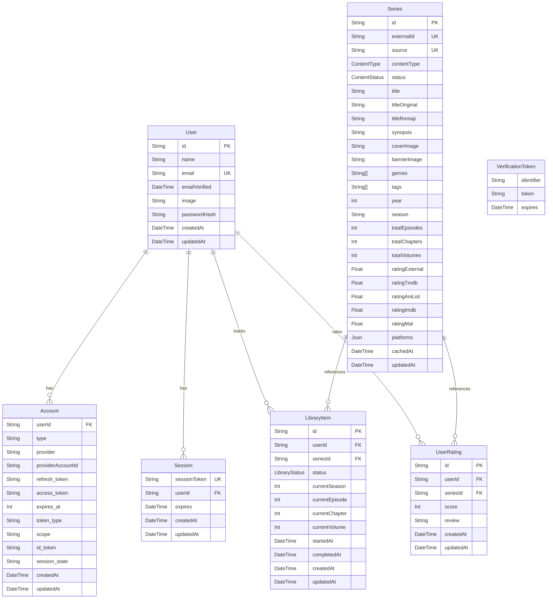

# Database Schema Design — Free Serie Tracker

This document describes the structured database schema used by **Free Serie Tracker** to store user accounts, authentication sessions, tracking lists, personal ratings, and the metadata cache.

The database uses a simplified, normalized relational structure optimized for Next.js App Router and serverless deployment targets (like Neon PostgreSQL).

---

## Entity Relationship Diagram

The following Mermaid ER Diagram models the tables and relationships defined in the Prisma schema:



---

## Prisma Schema

```prisma
// prisma/schema.prisma

generator client {
  provider = "prisma-client"
  output   = "../src/generated/prisma"
}

datasource db {
  provider = "postgresql"
}

// ─────────────────────────────────────────────────
// Auth Models (Auth.js v5 required schema)
// ─────────────────────────────────────────────────

model User {
  id            String    @id @default(cuid())
  name          String?
  email         String    @unique
  emailVerified DateTime?
  image         String?
  passwordHash  String?   // null for OAuth-only users
  createdAt     DateTime  @default(now())
  updatedAt     DateTime  @updatedAt

  accounts      Account[]
  sessions      Session[]
  libraryItems  LibraryItem[]
  userRatings   UserRating[]

  @@index([email])
}

model Account {
  userId            String
  type              String
  provider          String
  providerAccountId String
  refresh_token     String?
  access_token      String?
  expires_at        Int?
  token_type        String?
  scope             String?
  id_token          String?
  session_state     String?
  createdAt         DateTime @default(now())
  updatedAt         DateTime @updatedAt

  user User @relation(fields: [userId], references: [id], onDelete: Cascade)

  @@id([provider, providerAccountId])
  @@index([userId])
}

model Session {
  sessionToken String   @unique
  userId       String
  expires      DateTime
  createdAt    DateTime @default(now())
  updatedAt    DateTime @updatedAt

  user User @relation(fields: [userId], references: [id], onDelete: Cascade)

  @@index([userId])
}

model VerificationToken {
  identifier String
  token      String
  expires    DateTime

  @@id([identifier, token])
}

// ─────────────────────────────────────────────────
// Content Types
// ─────────────────────────────────────────────────

enum ContentType {
  TV_SERIES
  ANIME
  MANGA
  MANHWA
  LIGHT_NOVEL
  WEBTOON
}

enum ContentStatus {
  ONGOING      // Currently airing/publishing
  COMPLETED    // Finished
  HIATUS       // On break
  CANCELLED    // Cancelled/discontinued
  UPCOMING     // Not yet started
}

// ─────────────────────────────────────────────────
// Series (cached metadata from external APIs)
// ─────────────────────────────────────────────────

model Series {
  id              String        @id @default(cuid())
  externalId      String        // ID from source API (TMDB id, AniList id, etc.)
  source          String        // "tmdb" | "anilist" | "mangadex" | "jikan"
  contentType     ContentType
  status          ContentStatus @default(ONGOING)

  // Core info
  title           String
  titleOriginal   String?
  titleRomaji     String?
  synopsis        String?
  coverImage      String?       // URL
  bannerImage     String?       // URL
  genres          String[]      // ["Action", "Drama", ...]
  tags            String[]      // ["Based on Manga", "School", ...]
  year            Int?
  season          String?       // "Spring 2024" for anime

  // Episode / Chapter info
  totalEpisodes   Int?          // null = unknown/ongoing
  totalChapters   Int?          // for manga-type
  totalVolumes    Int?          // for light novels

  // External ratings (normalized 0.0 - 10.0)
  ratingExternal  Float?        // avg of available sources
  ratingTmdb      Float?
  ratingAniList   Float?
  ratingImdb      Float?
  ratingMal       Float?

  // Platform availability (stored as JSON)
  // [{ platformId, platformName, url, region, subscriptionType }]
  platforms       Json          @default("[]")

  cachedAt        DateTime      @default(now())
  updatedAt       DateTime      @updatedAt

  libraryItems    LibraryItem[]
  userRatings     UserRating[]

  @@unique([externalId, source])
  @@index([contentType])
  @@index([title])
  @@index([cachedAt])
}

// ─────────────────────────────────────────────────
// Library (User's personal tracking)
// ─────────────────────────────────────────────────

enum LibraryStatus {
  WATCHING     // Currently watching/reading
  PLAN_TO_WATCH
  COMPLETED
  ON_HOLD
  DROPPED
}

model LibraryItem {
  id        String        @id @default(cuid())
  userId    String
  seriesId  String
  status    LibraryStatus @default(PLAN_TO_WATCH)

  // Progress tracking
  currentSeason   Int?   // For TV series
  currentEpisode  Int?   // S2E5 → season=2, episode=5
  currentChapter  Int?   // Ch.45
  currentVolume   Int?   // Vol.3

  startedAt   DateTime?
  completedAt DateTime?
  createdAt   DateTime  @default(now())
  updatedAt   DateTime  @updatedAt

  user   User   @relation(fields: [userId], references: [id], onDelete: Cascade)
  series Series @relation(fields: [seriesId], references: [id], onDelete: Cascade)

  @@unique([userId, seriesId])
  @@index([userId])
  @@index([userId, status])
}

// ─────────────────────────────────────────────────
// User Ratings (personal score 1-10)
// ─────────────────────────────────────────────────

model UserRating {
  id        String   @id @default(cuid())
  userId    String
  seriesId  String
  score     Int      // 1-10
  review    String?  // Optional written review
  createdAt DateTime @default(now())
  updatedAt DateTime @updatedAt

  user   User   @relation(fields: [userId], references: [id], onDelete: Cascade)
  series Series @relation(fields: [seriesId], references: [id], onDelete: Cascade)

  @@unique([userId, seriesId])
  @@index([userId])
  @@index([seriesId])
}
```
