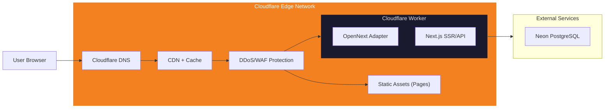

# Deployment Strategy — Generic SaaS Starter

## Why Cloudflare, Not Vercel?

| Özellik | Vercel Free (Hobby) | Cloudflare Free |
|---|---|---|
| **Ticari kullanım** | ❌ Yasak | ✅ Serbest |
| **Reklam** | ❌ Yasak | ✅ Serbest |
| **Bandwidth** | 100 GB/ay | **Sınırsız** |
| **Requests** | 100K serverless/ay | 100K workers/gün (günlük!) |
| **CDN** | Vercel Edge | Cloudflare Global (200+ PoP) |
| **DDoS koruması** | Temel | **Enterprise seviye (ücretsiz)** |
| **Custom domain** | ✅ | ✅ |
| **SSL** | ✅ | ✅ |
| **Build minutes** | 6000/ay | 500/ay (yeterli) |

> [!IMPORTANT]
> Vercel'in ücretsiz katmanı ticari kullanımı ve reklamı yasaklıyor — bir portfolyo/demo projesi için sorun değil, ama gerçek bir ürüne dönüştürmeyi planlıyorsanız bu kısıtlama önemli.

---

## Deployment: Cloudflare Workers + OpenNext

### Mimari



### Kurulum

```bash
# 1. OpenNext adapter ekle
npm install @opennextjs/cloudflare

# 2. Wrangler (Cloudflare CLI) ekle
npm install -D wrangler

# 3. next.config.ts güncelle — @opennextjs/cloudflare otomatik configure eder

# 4. wrangler.toml oluştur (proje kökünde)
```

### `wrangler.toml`

```toml
name = "generic-saas-starter"
compatibility_date = "2026-06-15"
compatibility_flags = ["nodejs_compat"]

# Main entrypoint — wraps the OpenNext-generated worker
main = "custom-worker.ts"

[assets]
directory = ".open-next/assets"
binding = "ASSETS"

# Environment variables (add secrets via: wrangler secret put <KEY>)
# DATABASE_URL
# DIRECT_URL
# NEXTAUTH_SECRET
# NEXTAUTH_URL
# GOOGLE_CLIENT_ID
# GOOGLE_CLIENT_SECRET

[dev]
port = 3001
```

`custom-worker.ts` (project root) wraps OpenNext's generated `.open-next/worker.js`, re-exporting its `fetch` handler — this indirection exists so the project has a place to add a Cloudflare Cron `scheduled()` export later, if your adaptation of this starter needs a background job (the original "Free Serie Tracker" had one for a now-removed feature; the wrapper is kept since it's a real, useful pattern even with nothing currently using it).

### Deploy Komutu

```bash
# Build + Deploy
npx opennextjs-cloudflare build
npx wrangler deploy

# Veya package.json script olarak (zaten tanımlı)
npm run deploy:build   # = opennextjs-cloudflare build
npm run deploy         # = opennextjs-cloudflare build && wrangler deploy
```

### CI/CD: GitHub Actions → Cloudflare

```yaml
# .github/workflows/deploy.yml
name: Deploy to Cloudflare
on:
  push:
    branches: [main]

jobs:
  deploy:
    runs-on: ubuntu-latest
    steps:
      - uses: actions/checkout@v4
      - uses: actions/setup-node@v4
        with:
          node-version: 20
      - run: npm ci
      - run: npx opennextjs-cloudflare build
      - uses: cloudflare/wrangler-action@v3
        with:
          apiToken: ${{ secrets.CLOUDFLARE_API_TOKEN }}
          command: deploy
```

The GitHub Actions workflow above runs on `ubuntu-latest` and is unaffected by the limitation described below — it always builds on a clean ASCII path.

---

## Known Limitation: Non-ASCII Project Paths on Windows

If you clone or move this project into a folder whose path contains non-ASCII characters (e.g. a OneDrive folder with an accented or non-Latin name — `Masaüstü`, `Café`, `文档`, etc.), `npx wrangler deploy` fails locally with esbuild errors like:

```
X [ERROR] Could not resolve ".../node_modules/next/dist/compiled/@vercel/og/resvg.wasm"
X [ERROR] Could not resolve ".../node_modules/next/dist/compiled/@vercel/og/yoga.wasm"
```

**Root cause:** these WASM files are dynamically imported by `next/dist/compiled/@vercel/og` (which backs this project's `icon.tsx`/`apple-icon.tsx` favicon generation, via `ImageResponse`). esbuild's module resolver — used internally by `wrangler deploy` to bundle the OpenNext worker output — mishandles the absolute path when it contains non-ASCII characters on Windows. `npm run deploy:build` (the Next.js + OpenNext build step) is unaffected and completes cleanly; the failure is specific to `wrangler`'s own bundling step.

**This does not affect the GitHub Actions deploy path above** — CI always runs on a clean ASCII path (`ubuntu-latest`'s `/home/runner/work/...`), so deploys via the documented CI workflow are unaffected regardless of what your local folder is named.

**Local workaround — verify and deploy from inside the project's Docker container**, which mounts the repo at `/app` (always ASCII), sidestepping the path issue entirely. Note the `-e NODE_ENV=production` override — the docker-compose service definition sets `NODE_ENV=development` for the dev server, which must be overridden for a production build:

```bash
docker compose run --rm -e NODE_ENV=production web sh -c "npm run deploy:build && npx wrangler deploy --dry-run"
```

Verification result (run inside Docker on this repo's `Masaüstü` path, commit `ab950f3`): `npm run deploy:build` exited with `OpenNext build complete.`; `npx wrangler deploy --dry-run` exited with `--dry-run: exiting now.` — no `resvg.wasm`/`yoga.wasm` errors seen. The Docker path at `/app` fully sidesteps the non-ASCII path bug.

> **Note:** Two additional issues surfaced during Docker verification that required code-level fixes (now committed — see `fix: add pg-cloudflare dep and disable useWorkerdCondition`):
> - `pg-cloudflare` was an optional transitive dep of `pg` that Alpine npm skipped; added as a direct dep so it's always installed.
> - OpenNext's default `useWorkerdCondition: true` caused esbuild on Linux to use the `"workerd"` export condition for `pg-cloudflare`, resolving to `dist/index.js` which wasn't present in the OpenNext-bundled node_modules copy. Disabled so esbuild uses the `"default"` export (`dist/empty.js`) at bundle time; the workerd socket is wired at runtime by the Cloudflare runtime itself.

If you need to deploy locally (not via CI) and your project path is non-ASCII, run the same way but without `--dry-run`, after completing the manual setup steps below and authenticating `wrangler` inside the container (`docker compose run --rm -e NODE_ENV=production web npx wrangler login` — this opens a browser-based OAuth flow, so it needs to run somewhere with browser access, e.g. via `wrangler login` on the host once, since the resulting auth token is stored under your global Wrangler config and Docker can mount it — see [Cloudflare's wrangler docs](https://developers.cloudflare.com/workers/wrangler/commands/#login) for the current recommended approach, since this varies by Docker/OS setup).

---

## Manual Deploy Runbook

This starter template ships with no live Cloudflare account, no production database, and no secrets configured — by design, since those are yours to set up. Here's the exact checklist, in order, the first time you deploy for real:

1. **Create a Cloudflare account** (free tier is enough) at [dash.cloudflare.com/sign-up](https://dash.cloudflare.com/sign-up).
2. **Authenticate Wrangler locally**: `npx wrangler login` — opens a browser OAuth flow, stores a token in your global Wrangler config.
3. **Create a production Neon PostgreSQL database** at [neon.tech](https://neon.tech) (free tier: 0.5 GB). Copy its pooled connection string (`DATABASE_URL`) and its direct/unpooled connection string (`DIRECT_URL`) from the Neon dashboard.
4. **Run migrations against the production database**:
   ```bash
   DATABASE_URL="<your-neon-pooled-url>" DIRECT_URL="<your-neon-direct-url>" npx prisma migrate deploy
   ```
5. **Generate a `NEXTAUTH_SECRET`**: `openssl rand -base64 32`.
6. **Set up Google OAuth** (if you want Google sign-in) at [console.cloud.google.com](https://console.cloud.google.com) → APIs & Services → Credentials → OAuth client ID. Add your production URL's `/api/auth/callback/google` as an authorized redirect URI.
7. **Push all 6 secrets to your Cloudflare Worker** (each prompts for the value interactively, or pipe it in):
   ```bash
   npx wrangler secret put DATABASE_URL
   npx wrangler secret put DIRECT_URL
   npx wrangler secret put NEXTAUTH_SECRET
   npx wrangler secret put NEXTAUTH_URL
   npx wrangler secret put GOOGLE_CLIENT_ID
   npx wrangler secret put GOOGLE_CLIENT_SECRET
   ```
   `NEXTAUTH_URL` should be your eventual production URL (e.g. `https://your-project.your-account.workers.dev`, or your custom domain once set up per the Domain Strategy below).
8. **Deploy**: `npm run deploy` (= `opennextjs-cloudflare build && wrangler deploy`). If your local path is non-ASCII, use the Docker workaround above instead.
9. **(Optional) Set up CI/CD**: add a `CLOUDFLARE_API_TOKEN` repo secret in GitHub (Settings → Secrets and variables → Actions) — generate the token at Cloudflare dashboard → My Profile → API Tokens → "Edit Cloudflare Workers" template — then add the `.github/workflows/deploy.yml` workflow shown above.

From here on, you're deploying and operating a real, internet-facing application — this guide stops at "it deploys," not "it's production-hardened." Review the Security Checklist in `CLAUDE.md` and your own threat model before pointing real users at it.

---

## Domain Stratejisi

### Başlangıç (Ücretsiz)

Cloudflare Workers otomatik subdomain verir: `<your-project>.<account>.workers.dev`

### GitHub Student Pack ile Free Domain

1. [GitHub Education](https://education.github.com/pack) başvurusu yap
2. Name.com'dan 1 yıl ücretsiz `.dev` veya `.com` domain al
3. Cloudflare DNS'e bağla (nameserver değiştir)
4. Cloudflare Workers'a custom domain ekle

### Domain Yenileme Planı

- 1. yıl: Ücretsiz (Student Pack)
- 2. yıl+: ~$10-12/yıl

---

## Maliyet Tablosu

| Hizmet | Aylık Maliyet |
|---|---|
| Cloudflare Workers + Pages | **$0** (free tier) |
| Neon PostgreSQL | **$0** (free tier: 0.5 GB) |
| Domain (Student Pack) | **$0** (1 yıl) |
| GitHub Private Repo | **$0** |
| **TOPLAM** | **$0/ay** |

### Büyüme Sonrası (Opsiyonel, gerçek bir ürüne dönüştürürseniz)

| Hizmet | Aylık Maliyet | Tetikleyici |
|---|---|---|
| Cloudflare Workers Paid | $5/ay | 100K+ req/gün aşılırsa |
| Neon PostgreSQL Pro | $19/ay | 0.5 GB storage dolunca |
| Domain yenileme | ~$1/ay | 2. yıl |

---

## Cloudflare'ın Ek Avantajları (Ücretsiz)

| Özellik | Açıklama |
|---|---|
| **DDoS Protection** | Enterprise seviye, otomatik |
| **Web Application Firewall** | SQL injection, XSS koruması |
| **Bot Protection** | Otomatik bot filtreleme |
| **Analytics** | Temel trafik analitiği |
| **DNS** | En hızlı DNS sağlayıcısı |
| **SSL/TLS** | Otomatik, full strict mode |
| **Rate Limiting** | Temel seviye ücretsiz |
