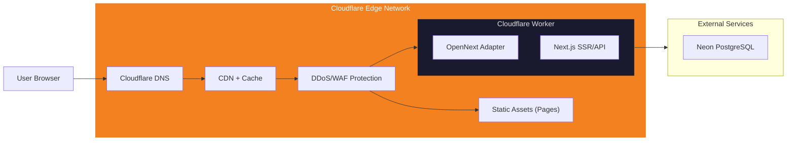

# Deployment Strategy — Generic SaaS Starter

## Why Cloudflare, Not Vercel?

| Özellik | Vercel Free (Hobby) | Cloudflare Free |
|---|---|---|
| **Ticari kullanım** | ❌ Yasak | ✅ Serbest |
| **Reklam** | ❌ Yasak | ✅ Serbest |
| **Bandwidth** | 100 GB/ay | **Sınırsız** |
| **Requests** | 100K serverless/ay | 100K workers/gün (günlük!) |
| **CDN** | Vercel Edge | Cloudflare Global (200+ PoP) |
| **DDoS koruması** | Temel | **Enterprise seviye (ücretsiz)** |
| **Custom domain** | ✅ | ✅ |
| **SSL** | ✅ | ✅ |
| **Build minutes** | 6000/ay | 500/ay (yeterli) |

> [!IMPORTANT]
> Vercel'in ücretsiz katmanı ticari kullanımı ve reklamı yasaklıyor — bir portfolyo/demo projesi için sorun değil, ama gerçek bir ürüne dönüştürmeyi planlıyorsanız bu kısıtlama önemli.

---

## Deployment: Cloudflare Workers + OpenNext

### Mimari



### Kurulum

```bash
# 1. OpenNext adapter ekle
npm install @opennextjs/cloudflare

# 2. Wrangler (Cloudflare CLI) ekle
npm install -D wrangler

# 3. next.config.ts güncelle — @opennextjs/cloudflare otomatik configure eder

# 4. wrangler.toml oluştur (proje kökünde)
```

### `wrangler.toml`

```toml
name = "generic-saas-starter"
compatibility_date = "2026-06-15"
compatibility_flags = ["nodejs_compat"]

# Main entrypoint — wraps the OpenNext-generated worker
main = "custom-worker.ts"

[assets]
directory = ".open-next/assets"
binding = "ASSETS"

# Environment variables (add secrets via: wrangler secret put <KEY>)
# DATABASE_URL
# DIRECT_URL
# NEXTAUTH_SECRET
# NEXTAUTH_URL
# GOOGLE_CLIENT_ID
# GOOGLE_CLIENT_SECRET

[dev]
port = 3001
```

`custom-worker.ts` (project root) wraps OpenNext's generated `.open-next/worker.js`, re-exporting its `fetch` handler — this indirection exists so the project has a place to add a Cloudflare Cron `scheduled()` export later, if your adaptation of this starter needs a background job (the original "Free Serie Tracker" had one for a now-removed feature; the wrapper is kept since it's a real, useful pattern even with nothing currently using it).

### Deploy Komutu

```bash
# Build + Deploy
npx opennextjs-cloudflare build
npx wrangler deploy

# Veya package.json script olarak (zaten tanımlı)
npm run deploy:build   # = opennextjs-cloudflare build
npm run deploy         # = opennextjs-cloudflare build && wrangler deploy
```

### CI/CD: GitHub Actions → Cloudflare

```yaml
# .github/workflows/deploy.yml
name: Deploy to Cloudflare
on:
  push:
    branches: [main]

jobs:
  deploy:
    runs-on: ubuntu-latest
    steps:
      - uses: actions/checkout@v4
      - uses: actions/setup-node@v4
        with:
          node-version: 20
      - run: npm ci
      - run: npx opennextjs-cloudflare build
      - uses: cloudflare/wrangler-action@v3
        with:
          apiToken: ${{ secrets.CLOUDFLARE_API_TOKEN }}
          command: deploy
```

---

## Domain Stratejisi

### Başlangıç (Ücretsiz)

Cloudflare Workers otomatik subdomain verir: `<your-project>.<account>.workers.dev`

### GitHub Student Pack ile Free Domain

1. [GitHub Education](https://education.github.com/pack) başvurusu yap
2. Name.com'dan 1 yıl ücretsiz `.dev` veya `.com` domain al
3. Cloudflare DNS'e bağla (nameserver değiştir)
4. Cloudflare Workers'a custom domain ekle

### Domain Yenileme Planı

- 1. yıl: Ücretsiz (Student Pack)
- 2. yıl+: ~$10-12/yıl

---

## Maliyet Tablosu

| Hizmet | Aylık Maliyet |
|---|---|
| Cloudflare Workers + Pages | **$0** (free tier) |
| Neon PostgreSQL | **$0** (free tier: 0.5 GB) |
| Domain (Student Pack) | **$0** (1 yıl) |
| GitHub Private Repo | **$0** |
| **TOPLAM** | **$0/ay** |

### Büyüme Sonrası (Opsiyonel, gerçek bir ürüne dönüştürürseniz)

| Hizmet | Aylık Maliyet | Tetikleyici |
|---|---|---|
| Cloudflare Workers Paid | $5/ay | 100K+ req/gün aşılırsa |
| Neon PostgreSQL Pro | $19/ay | 0.5 GB storage dolunca |
| Domain yenileme | ~$1/ay | 2. yıl |

---

## Cloudflare'ın Ek Avantajları (Ücretsiz)

| Özellik | Açıklama |
|---|---|
| **DDoS Protection** | Enterprise seviye, otomatik |
| **Web Application Firewall** | SQL injection, XSS koruması |
| **Bot Protection** | Otomatik bot filtreleme |
| **Analytics** | Temel trafik analitiği |
| **DNS** | En hızlı DNS sağlayıcısı |
| **SSL/TLS** | Otomatik, full strict mode |
| **Rate Limiting** | Temel seviye ücretsiz |
