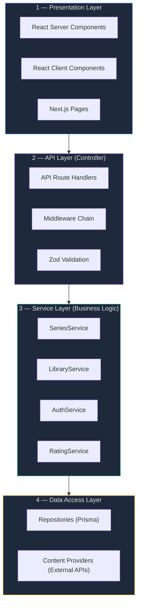
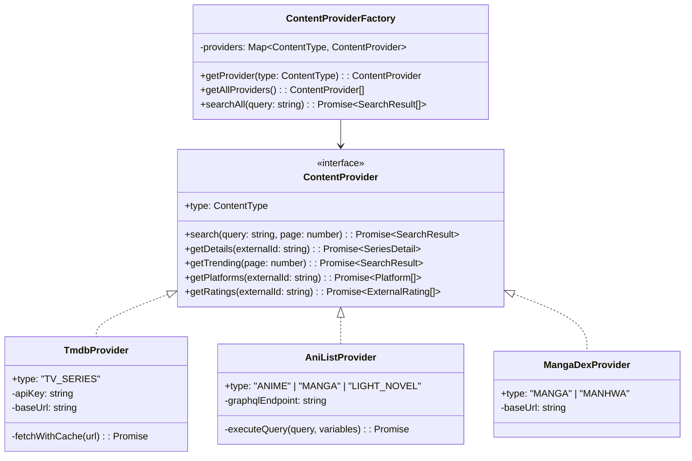
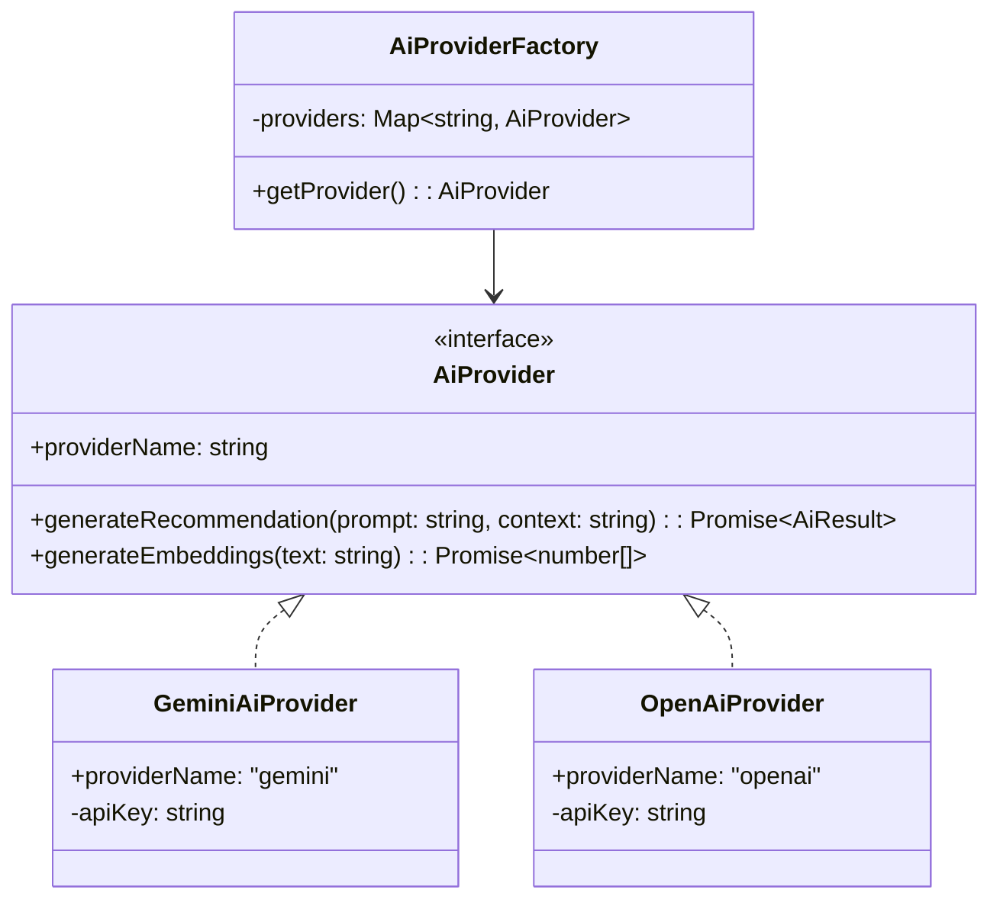
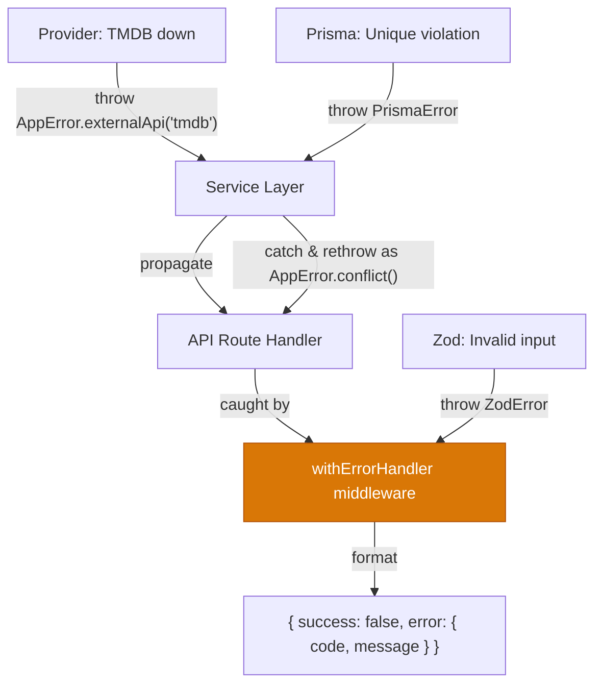

# Design Patterns & Architecture Deep Dive — Free Serie Tracker

Bu doküman projedeki her katmanın **neden** o şekilde tasarlandığını, hangi design pattern'in **nerede** ve **nasıl** kullanıldığını detaylı açıklar.

---

## 1. Overall Architecture: Layered (N-Tier) Architecture

Projede **4 katmanlı mimari** kullanıyoruz. Her katman yalnızca bir alt katmanla konuşur, üst katmanı bilmez.



### Katman Kuralları

| Kural | Açıklama |
|---|---|
| **Tek yönlü bağımlılık** | Presentation → API → Service → Data Access. Asla tersi olmaz. |
| **Katman atlama yok** | Bir Page doğrudan Repository çağıramaz. Service katmanından geçmeli. |
| **İş mantığı Service'te** | API Route'lar sadece request parse + response format yapar. Mantık Service'te. |
| **Dış dünya DAL'da** | Prisma ve External API çağrıları sadece Data Access Layer'da. |

---

## 2. Repository Pattern

**Neden?** Prisma'yı doğrudan Service katmanında çağırmak yerine, Repository katmanı ile soyutluyoruz. Böylece:
- Veritabanı sorguları tek yerde toplanır (DRY)
- Test edilebilirlik artar (mock'lanabilir)
- ORM değişikliği durumunda sadece repository değişir

### Yapı

```
src/lib/repositories/
├── base.repository.ts          # Abstract base — ortak CRUD
├── series.repository.ts        # Series tablosu sorguları
├── library.repository.ts       # UserLibrary + Progress sorguları
├── rating.repository.ts        # UserRating + ExternalRating sorguları
├── user.repository.ts          # User tablosu sorguları
└── index.ts                    # Barrel export
```

### Örnek Implementasyon

```typescript
// src/lib/repositories/base.repository.ts
import { PrismaClient } from "@prisma/client";
import { db } from "@/lib/db/client";

export abstract class BaseRepository {
  protected db: PrismaClient;

  constructor() {
    this.db = db;
  }
}

// src/lib/repositories/series.repository.ts
import { BaseRepository } from "./base.repository";
import { ContentType, SeriesStatus, Prisma } from "@prisma/client";

export class SeriesRepository extends BaseRepository {
  async findById(id: string) {
    return this.db.series.findUnique({
      where: { id },
      include: {
        genres: true,
        platforms: true,
        externalRatings: true,
      },
    });
  }

  async findByExternalId(externalId: string, source: string) {
    return this.db.series.findUnique({
      where: {
        externalId_externalSource: { externalId, externalSource: source },
      },
    });
  }

  async search(params: {
    query?: string;
    type?: ContentType;
    genre?: string;
    status?: SeriesStatus;
    page: number;
    pageSize: number;
    sortBy?: string;
    sortOrder?: "asc" | "desc";
  }) {
    const where: Prisma.SeriesWhereInput = {};

    if (params.query) {
      where.title = { contains: params.query, mode: "insensitive" };
    }
    if (params.type) where.contentType = params.type;
    if (params.status) where.status = params.status;
    if (params.genre) {
      where.genres = { some: { name: params.genre } };
    }

    const [items, total] = await this.db.$transaction([
      this.db.series.findMany({
        where,
        include: { genres: true, externalRatings: true },
        skip: (params.page - 1) * params.pageSize,
        take: params.pageSize,
        orderBy: { [params.sortBy || "updatedAt"]: params.sortOrder || "desc" },
      }),
      this.db.series.count({ where }),
    ]);

    return { items, total };
  }

  async upsert(data: Prisma.SeriesCreateInput) {
    return this.db.series.upsert({
      where: {
        externalId_externalSource: {
          externalId: data.externalId,
          externalSource: data.externalSource,
        },
      },
      create: data,
      update: data,
    });
  }
}

// src/lib/repositories/library.repository.ts
import { BaseRepository } from "./base.repository";
import { LibraryStatus, ContentType } from "@prisma/client";

export class LibraryRepository extends BaseRepository {
  async findByUser(userId: string, filters: {
    status?: LibraryStatus;
    contentType?: ContentType;
    page: number;
    pageSize: number;
    sortBy?: string;
  }) {
    const where: any = { userId };
    if (filters.status) where.status = filters.status;
    if (filters.contentType) {
      where.series = { contentType: filters.contentType };
    }

    const [items, total] = await this.db.$transaction([
      this.db.userLibrary.findMany({
        where,
        include: {
          series: { include: { genres: true, externalRatings: true } },
          progress: true,
        },
        skip: (filters.page - 1) * filters.pageSize,
        take: filters.pageSize,
        orderBy: { [filters.sortBy || "updatedAt"]: "desc" },
      }),
      this.db.userLibrary.count({ where }),
    ]);

    return { items, total };
  }

  async addToLibrary(userId: string, seriesId: string, status: LibraryStatus) {
    return this.db.userLibrary.create({
      data: {
        userId,
        seriesId,
        status,
        progress: {
          create: {
            currentEpisode: 0,
            currentSeason: 1,
            currentChapter: 0,
            currentVolume: 1,
          },
        },
      },
      include: { series: true, progress: true },
    });
  }

  async updateProgress(libraryId: string, progress: {
    currentEpisode?: number;
    currentSeason?: number;
    currentChapter?: number;
    currentVolume?: number;
  }) {
    return this.db.progress.update({
      where: { userLibraryId: libraryId },
      data: { ...progress, lastUpdated: new Date() },
    });
  }

  async findEntry(userId: string, seriesId: string) {
    return this.db.userLibrary.findUnique({
      where: { userId_seriesId: { userId, seriesId } },
      include: { progress: true },
    });
  }
}
```

---

## 3. Strategy Pattern — Content Providers

**Neden?** 6 farklı içerik tipi (TV, Anime, Manga…) var ve her biri farklı API'den veri çeker. Strategy pattern ile:
- Yeni içerik tipi eklemek = yeni bir Provider sınıfı yazmak
- Mevcut koda dokunmadan genişletme (Open/Closed Principle)
- Her Provider bağımsız test edilebilir



### Yapı

```
src/lib/providers/
├── content-provider.interface.ts   # Interface tanımı
├── tmdb.provider.ts                # TMDB — TV Series
├── anilist.provider.ts             # AniList — Anime, Manga, LN, Webtoon
├── mangadex.provider.ts            # MangaDex — Manga, Manhwa (chapter data)
├── jikan.provider.ts               # Jikan — MAL backup ratings
├── provider.factory.ts             # Factory — hangi tipi hangi provider karşılar
└── index.ts
```

### Örnek Implementasyon

```typescript
// src/lib/providers/content-provider.interface.ts
import { ContentType } from "@prisma/client";

export interface SearchResult {
  externalId: string;
  externalSource: string;
  contentType: ContentType;
  title: string;
  originalTitle?: string;
  posterUrl?: string;
  description?: string;
  status?: string;
  genres: string[];
  year?: number;
  rating?: number;
  ratingSource?: string;
}

export interface SeriesDetail extends SearchResult {
  bannerUrl?: string;
  totalEpisodes?: number;
  totalChapters?: number;
  totalSeasons?: number;
  totalVolumes?: number;
  startDate?: string;
  endDate?: string;
}

export interface PlatformInfo {
  name: string;
  logo?: string;
  url?: string;
  region: string;
}

export interface ExternalRatingInfo {
  source: string;
  score: number;     // Normalized 0-10
  voteCount: number;
}

export interface ContentProvider {
  readonly supportedTypes: ContentType[];

  search(query: string, page?: number, pageSize?: number): Promise<{
    items: SearchResult[];
    totalItems: number;
  }>;

  getDetails(externalId: string): Promise<SeriesDetail | null>;

  getTrending(page?: number, pageSize?: number): Promise<{
    items: SearchResult[];
    totalItems: number;
  }>;

  getPlatforms(externalId: string, region?: string): Promise<PlatformInfo[]>;

  getRatings(externalId: string): Promise<ExternalRatingInfo[]>;
}

// src/lib/providers/provider.factory.ts
import { ContentType } from "@prisma/client";
import { ContentProvider, SearchResult } from "./content-provider.interface";
import { TmdbProvider } from "./tmdb.provider";
import { AniListProvider } from "./anilist.provider";
import { MangaDexProvider } from "./mangadex.provider";

export class ContentProviderFactory {
  private providers: Map<ContentType, ContentProvider>;

  constructor() {
    const tmdb = new TmdbProvider();
    const anilist = new AniListProvider();
    const mangadex = new MangaDexProvider();

    this.providers = new Map<ContentType, ContentProvider>([
      ["TV_SERIES", tmdb],
      ["ANIME", anilist],
      ["MANGA", anilist],           // AniList for metadata
      ["MANHWA", anilist],
      ["LIGHT_NOVEL", anilist],
      ["WEBTOON", anilist],
    ]);
  }

  getProvider(type: ContentType): ContentProvider {
    const provider = this.providers.get(type);
    if (!provider) {
      throw new AppError("PROVIDER_NOT_FOUND", `No provider for type: ${type}`, 500);
    }
    return provider;
  }

  /**
   * Tüm provider'larda aynı anda arama yapar.
   * Belirli bir type verilmezse hepsinde arar.
   */
  async searchAll(query: string, type?: ContentType): Promise<SearchResult[]> {
    if (type) {
      const provider = this.getProvider(type);
      const result = await provider.search(query);
      return result.items;
    }

    // Tüm unique provider'larda paralel ara
    const uniqueProviders = [...new Set(this.providers.values())];
    const results = await Promise.allSettled(
      uniqueProviders.map((p) => p.search(query))
    );

    return results
      .filter((r): r is PromiseFulfilledResult<any> => r.status === "fulfilled")
      .flatMap((r) => r.value.items);
  }
}

// Singleton instance
export const contentProviders = new ContentProviderFactory();
```

### 3.1. Strategy Pattern — AI Recommendation Engines (Phase 2.7)

**Neden?** Yapay zeka servis sağlayıcıları (Gemini, OpenAI, Anthropic) ve API anahtarları zamanla değişebilir veya müşteri farklı bir modele geçmek isteyebilir. AI motorunu soyutlayarak:
- Sağlayıcılar arası dinamik geçiş (Gemini ↔ OpenAI) sadece `.env` dosyasındaki `AI_PROVIDER` değişkenini değiştirmek kadar kolaylaşır.
- İş mantığı (AI Search / Recommendation) hangi yapay zeka modelinin çalıştığını bilmek zorunda kalmaz.
- Mock AI sağlayıcılar yazılarak testler kolayca gerçekleştirilebilir.



#### Örnek Implementasyon

```typescript
// src/lib/providers/ai/ai-provider.interface.ts
export interface AiResult {
  explanation: string;
}

export interface AiProvider {
  readonly providerName: string;
  generateRecommendation(prompt: string, context: string): Promise<AiResult>;
  generateEmbeddings(text: string): Promise<number[]>;
}

// src/lib/providers/ai/gemini.provider.ts
import { AiProvider, AiResult } from "./ai-provider.interface";

export class GeminiAiProvider implements AiProvider {
  readonly providerName = "gemini";
  private apiKey: string;

  constructor() {
    this.apiKey = process.env.GEMINI_API_KEY || "";
  }

  async generateRecommendation(prompt: string, context: string): Promise<AiResult> {
    // Gemini API call...
    return { explanation: "Gemini recommendations based on context..." };
  }

  async generateEmbeddings(text: string): Promise<number[]> {
    // Gemini text-embedding-004 vector generation (1536 dim)
    return new Array(1536).fill(0);
  }
}

// src/lib/providers/ai/openai.provider.ts
import { AiProvider, AiResult } from "./ai-provider.interface";

export class OpenAiProvider implements AiProvider {
  readonly providerName = "openai";
  private apiKey: string;

  constructor() {
    this.apiKey = process.env.OPENAI_API_KEY || "";
  }

  async generateRecommendation(prompt: string, context: string): Promise<AiResult> {
    // OpenAI gpt-4o API call...
    return { explanation: "OpenAI recommendations based on context..." };
  }

  async generateEmbeddings(text: string): Promise<number[]> {
    // OpenAI text-embedding-3-small vector generation (1536 dim)
    return new Array(1536).fill(0);
  }
}

// src/lib/providers/ai/ai-factory.ts
import { AiProvider } from "./ai-provider.interface";
import { GeminiAiProvider } from "./gemini.provider";
import { OpenAiProvider } from "./openai.provider";

export class AiProviderFactory {
  private providers = new Map<string, AiProvider>();

  constructor() {
    this.providers.set("gemini", new GeminiAiProvider());
    this.providers.set("openai", new OpenAiProvider());
  }

  getProvider(): AiProvider {
    const selected = process.env.AI_PROVIDER || "gemini";
    const provider = this.providers.get(selected);
    if (!provider) {
      throw new Error(`AI Provider not configured: ${selected}`);
    }
    return provider;
  }
}

export const aiProvider = new AiProviderFactory().getProvider();
```

---

## 4. Service Layer Pattern

**Neden?** İş mantığı API Route'lardan ayrılmalı. Service katmanı:
- Transaction yönetimi (birden fazla repository operasyonu)
- İş kuralları (duplicate check, validation sonrası logic)
- Orchestration (dış API + DB birlikte çalışma)

### Yapı

```
src/lib/services/
├── series.service.ts           # Seri keşfetme, arama, detay
├── library.service.ts          # Kullanıcı kütüphanesi iş mantığı
├── rating.service.ts           # Puanlama iş mantığı
├── auth.service.ts             # Auth helper'lar
└── index.ts
```

### Örnek: SeriesService (Orchestration)

```typescript
// src/lib/services/series.service.ts
import { SeriesRepository } from "@/lib/repositories/series.repository";
import { contentProviders } from "@/lib/providers/provider.factory";
import { ContentType } from "@prisma/client";
import { SeriesDetailResponse, SeriesCardResponse } from "@/types/api";

export class SeriesService {
  private repo: SeriesRepository;

  constructor() {
    this.repo = new SeriesRepository();
  }

  /**
   * Arama akışı:
   * 1. Önce dış API'den ara (TMDB / AniList)
   * 2. Sonuçları DB'ye upsert et (cache amaçlı)
   * 3. Normalize edilmiş sonuçları döndür
   */
  async search(query: string, type?: ContentType, page = 1, pageSize = 20) {
    // 1. Dış API'den ara
    const externalResults = await contentProviders.searchAll(query, type);

    // 2. DB'ye upsert (background, response'u bekletme)
    this.syncToDatabase(externalResults).catch(console.error);

    // 3. Sonuçları pagination'la döndür
    const start = (page - 1) * pageSize;
    const paginatedItems = externalResults.slice(start, start + pageSize);

    return {
      items: paginatedItems.map(this.toSeriesCard),
      totalItems: externalResults.length,
      page,
      pageSize,
      totalPages: Math.ceil(externalResults.length / pageSize),
    };
  }

  /**
   * Detay akışı:
   * 1. DB'de var mı bak
   * 2. Yoksa veya eski ise dış API'den çek
   * 3. Platform availability'yi çek
   * 4. Tüm kaynakların ratinglerini topla
   */
  async getDetails(id: string): Promise<SeriesDetailResponse> {
    // DB'den bak
    let series = await this.repo.findById(id);

    if (!series) {
      throw new AppError("NOT_FOUND", "Series not found", 404);
    }

    // Eğer veri 24 saatten eski ise dış API'den güncelle
    const isStale = this.isDataStale(series.updatedAt, 24 * 60 * 60 * 1000);
    if (isStale) {
      const provider = contentProviders.getProvider(series.contentType);
      const freshData = await provider.getDetails(series.externalId);
      if (freshData) {
        series = await this.repo.upsert(this.toCreateInput(freshData));
      }
    }

    // Platform ve rating bilgilerini paralel çek
    const provider = contentProviders.getProvider(series.contentType);
    const [platforms, ratings] = await Promise.all([
      provider.getPlatforms(series.externalId),
      provider.getRatings(series.externalId),
    ]);

    return this.toDetailResponse(series, platforms, ratings);
  }

  // ... private helper methods
  private isDataStale(updatedAt: Date, maxAgeMs: number): boolean {
    return Date.now() - updatedAt.getTime() > maxAgeMs;
  }

  private toSeriesCard(result: any): SeriesCardResponse {
    return {
      id: result.id || result.externalId,
      externalId: result.externalId,
      externalSource: result.externalSource,
      contentType: result.contentType,
      title: result.title,
      posterUrl: result.posterUrl || null,
      status: result.status || "ONGOING",
      rating: result.rating || null,
      ratingSource: result.ratingSource || null,
      genres: result.genres || [],
      year: result.year || null,
    };
  }

  private async syncToDatabase(results: any[]) {
    for (const result of results) {
      await this.repo.upsert(this.toCreateInput(result));
    }
  }

  private toCreateInput(data: any) { /* ... mapping logic ... */ }
  private toDetailResponse(series: any, platforms: any[], ratings: any[]) { /* ... */ }
}
```

### Örnek: LibraryService (Business Rules)

```typescript
// src/lib/services/library.service.ts
import { LibraryRepository } from "@/lib/repositories/library.repository";
import { SeriesRepository } from "@/lib/repositories/series.repository";
import { LibraryStatus } from "@prisma/client";
import { AppError } from "@/lib/errors";

export class LibraryService {
  private libraryRepo: LibraryRepository;
  private seriesRepo: SeriesRepository;

  constructor() {
    this.libraryRepo = new LibraryRepository();
    this.seriesRepo = new SeriesRepository();
  }

  async addToLibrary(userId: string, seriesId: string, status: LibraryStatus) {
    // İş kuralı: Aynı seri iki kez eklenemez
    const existing = await this.libraryRepo.findEntry(userId, seriesId);
    if (existing) {
      throw new AppError("CONFLICT", "Series already in library", 409);
    }

    // İş kuralı: Seri DB'de olmalı
    const series = await this.seriesRepo.findById(seriesId);
    if (!series) {
      throw new AppError("NOT_FOUND", "Series not found", 404);
    }

    return this.libraryRepo.addToLibrary(userId, seriesId, status);
  }

  async updateProgress(userId: string, libraryId: string, progress: {
    currentEpisode?: number;
    currentSeason?: number;
    currentChapter?: number;
    currentVolume?: number;
  }) {
    // İş kuralı: Library entry kullanıcıya ait olmalı
    const entry = await this.libraryRepo.findById(libraryId);
    if (!entry || entry.userId !== userId) {
      throw new AppError("FORBIDDEN", "Not your library entry", 403);
    }

    // İş kuralı: Bölüm numarası totalden büyük olamaz
    if (progress.currentEpisode && entry.series.totalEpisodes) {
      if (progress.currentEpisode > entry.series.totalEpisodes) {
        throw new AppError("VALIDATION_ERROR", "Episode exceeds total", 400);
      }
    }

    // İş kuralı: Tüm bölümleri izlediyse otomatik COMPLETED yap
    const updated = await this.libraryRepo.updateProgress(libraryId, progress);
    if (this.isCompleted(updated, entry.series)) {
      await this.libraryRepo.updateStatus(libraryId, "COMPLETED");
    }

    return updated;
  }

  private isCompleted(progress: any, series: any): boolean {
    if (series.totalEpisodes && progress.currentEpisode >= series.totalEpisodes) {
      return true;
    }
    if (series.totalChapters && progress.currentChapter >= series.totalChapters) {
      return true;
    }
    return false;
  }
}
```

---

## 5. API Route Pattern (Controller Layer)

**Neden?** API Route'lar sadece şunları yapar:
1. Request parse (query params, body)
2. Input validation (Zod)
3. Auth check
4. Service çağrısı
5. Response format

**ASLA iş mantığı içermez.**

### Yapı

```
src/app/api/
├── auth/
│   ├── register/route.ts
│   ├── [...nextauth]/route.ts    # Auth.js catch-all
│   └── session/route.ts
├── series/
│   ├── route.ts                  # GET /api/series (search)
│   ├── trending/route.ts         # GET /api/series/trending
│   └── [id]/
│       ├── route.ts              # GET /api/series/:id
│       └── similar/route.ts      # GET /api/series/:id/similar
├── library/
│   ├── route.ts                  # GET, POST /api/library
│   └── [id]/
│       ├── route.ts              # PATCH, DELETE /api/library/:id
│       └── progress/route.ts     # PATCH /api/library/:id/progress
├── ratings/
│   ├── route.ts                  # POST /api/ratings
│   └── [id]/route.ts             # PATCH, DELETE /api/ratings/:id
├── explore/
│   ├── route.ts                  # GET /api/explore
│   ├── genres/route.ts           # GET /api/explore/genres
│   └── platforms/route.ts        # GET /api/explore/platforms
└── docs/route.ts                 # GET /api/docs → Swagger JSON
```

### Örnek: API Route Handler

```typescript
// src/app/api/library/route.ts
import { NextRequest, NextResponse } from "next/server";
import { auth } from "@/lib/auth/config";
import { LibraryService } from "@/lib/services/library.service";
import { addToLibrarySchema, libraryQuerySchema } from "@/lib/validations/library";
import { withErrorHandler } from "@/lib/middleware/error-handler";
import { withRateLimit } from "@/lib/middleware/rate-limit";
import { apiResponse, apiError } from "@/lib/utils/api-response";

const libraryService = new LibraryService();

// GET /api/library — Kullanıcının kütüphanesini getir
export const GET = withErrorHandler(
  withRateLimit(async (req: NextRequest) => {
    const session = await auth();
    if (!session?.user?.id) {
      return apiError("UNAUTHORIZED", "Authentication required", 401);
    }

    const params = libraryQuerySchema.parse(
      Object.fromEntries(req.nextUrl.searchParams)
    );

    const result = await libraryService.getUserLibrary(session.user.id, params);

    return apiResponse(result.items, {
      page: result.page,
      pageSize: result.pageSize,
      totalPages: result.totalPages,
      totalItems: result.totalItems,
    });
  }, { limit: 60, window: 60 })
);

// POST /api/library — Kütüphaneye ekle
export const POST = withErrorHandler(
  withRateLimit(async (req: NextRequest) => {
    const session = await auth();
    if (!session?.user?.id) {
      return apiError("UNAUTHORIZED", "Authentication required", 401);
    }

    const body = await req.json();
    const validated = addToLibrarySchema.parse(body);

    const entry = await libraryService.addToLibrary(
      session.user.id,
      validated.seriesId,
      validated.status
    );

    return apiResponse(entry, undefined, 201);
  }, { limit: 60, window: 60 })
);
```

---

## 6. Middleware Chain Pattern

Request'ler bir middleware zincirinden geçer. Her middleware tek bir iş yapar.


### Yapı

```
src/lib/middleware/
├── rate-limit.ts               # Token bucket rate limiter
├── error-handler.ts            # Global error catching wrapper
├── auth-guard.ts               # Auth check HOF
└── validate.ts                 # Zod validation HOF
```

### Implementasyon: Higher-Order Function (HOF) Middleware

```typescript
// src/lib/middleware/error-handler.ts
import { NextRequest, NextResponse } from "next/server";
import { ZodError } from "zod";
import { AppError } from "@/lib/errors";

type RouteHandler = (req: NextRequest, context?: any) => Promise<NextResponse>;

/**
 * Wraps a route handler with global error handling.
 * Her API route bunu kullanmalı.
 */
export function withErrorHandler(handler: RouteHandler): RouteHandler {
  return async (req: NextRequest, context?: any) => {
    try {
      return await handler(req, context);
    } catch (error) {
      // Zod validation error
      if (error instanceof ZodError) {
        return NextResponse.json(
          {
            success: false,
            error: {
              code: "VALIDATION_ERROR",
              message: "Invalid input",
              details: error.errors.map((e) => ({
                field: e.path.join("."),
                message: e.message,
              })),
            },
          },
          { status: 400 }
        );
      }

      // Custom application error
      if (error instanceof AppError) {
        return NextResponse.json(
          {
            success: false,
            error: { code: error.code, message: error.message },
          },
          { status: error.statusCode }
        );
      }

      // Unexpected error — logla, kullanıcıya genel mesaj ver
      console.error("[API Error]", error);
      return NextResponse.json(
        {
          success: false,
          error: { code: "INTERNAL_ERROR", message: "Something went wrong" },
        },
        { status: 500 }
      );
    }
  };
}

// src/lib/middleware/rate-limit.ts
import { NextRequest, NextResponse } from "next/server";

interface RateLimitConfig {
  limit: number;    // Max requests
  window: number;   // Time window in seconds
}

// In-memory store (Vercel serverless — her instance kendi store'u)
// Production'da Upstash Redis'e geçilebilir
const store = new Map<string, { count: number; resetAt: number }>();

type RouteHandler = (req: NextRequest, context?: any) => Promise<NextResponse>;

export function withRateLimit(handler: RouteHandler, config: RateLimitConfig): RouteHandler {
  return async (req: NextRequest, context?: any) => {
    const ip = req.headers.get("x-forwarded-for") || "unknown";
    const key = `${ip}:${req.nextUrl.pathname}`;
    const now = Date.now();

    const entry = store.get(key);

    if (!entry || entry.resetAt < now) {
      store.set(key, { count: 1, resetAt: now + config.window * 1000 });
    } else {
      entry.count++;
      if (entry.count > config.limit) {
        return NextResponse.json(
          {
            success: false,
            error: { code: "RATE_LIMITED", message: "Too many requests" },
          },
          {
            status: 429,
            headers: {
              "Retry-After": String(Math.ceil((entry.resetAt - now) / 1000)),
              "X-RateLimit-Limit": String(config.limit),
              "X-RateLimit-Remaining": "0",
            },
          }
        );
      }
    }

    const response = await handler(req, context);

    // Rate limit headers ekle
    const remaining = config.limit - (store.get(key)?.count || 0);
    response.headers.set("X-RateLimit-Limit", String(config.limit));
    response.headers.set("X-RateLimit-Remaining", String(Math.max(0, remaining)));

    return response;
  };
}

// src/lib/middleware/auth-guard.ts
import { NextRequest, NextResponse } from "next/server";
import { auth } from "@/lib/auth/config";
import { apiError } from "@/lib/utils/api-response";

type RouteHandler = (req: NextRequest, context?: any) => Promise<NextResponse>;

/**
 * Auth gerektiren route'lar için guard.
 * Session'ı request context'e ekler.
 */
export function withAuth(handler: RouteHandler): RouteHandler {
  return async (req: NextRequest, context?: any) => {
    const session = await auth();
    if (!session?.user?.id) {
      return apiError("UNAUTHORIZED", "Authentication required", 401);
    }

    // Session bilgisini header'a ekle (handler'da kullanmak için)
    (req as any).userId = session.user.id;
    (req as any).session = session;

    return handler(req, context);
  };
}
```

---

## 7. Custom Error Handling Pattern

**Neden?** Tutarlı hata yönetimi için merkezi bir error sınıfı.

```typescript
// src/lib/errors/index.ts

export class AppError extends Error {
  constructor(
    public readonly code: string,
    public readonly message: string,
    public readonly statusCode: number,
    public readonly details?: Record<string, unknown>
  ) {
    super(message);
    this.name = "AppError";
  }

  // Factory methods — okunabilirlik için
  static notFound(resource: string) {
    return new AppError("NOT_FOUND", `${resource} not found`, 404);
  }

  static unauthorized(message = "Authentication required") {
    return new AppError("UNAUTHORIZED", message, 401);
  }

  static forbidden(message = "Access denied") {
    return new AppError("FORBIDDEN", message, 403);
  }

  static conflict(message: string) {
    return new AppError("CONFLICT", message, 409);
  }

  static validation(message: string, details?: Record<string, unknown>) {
    return new AppError("VALIDATION_ERROR", message, 400, details);
  }

  static externalApi(source: string, originalError?: Error) {
    return new AppError(
      "EXTERNAL_API_ERROR",
      `Failed to fetch from ${source}`,
      502,
      { source, originalMessage: originalError?.message }
    );
  }
}
```

### Error Flow



---

## 8. API Response Helper Pattern

```typescript
// src/lib/utils/api-response.ts
import { NextResponse } from "next/server";

interface PaginationMeta {
  page: number;
  pageSize: number;
  totalPages: number;
  totalItems: number;
}

/**
 * Tutarlı başarılı response
 */
export function apiResponse<T>(
  data: T,
  meta?: PaginationMeta,
  status = 200
): NextResponse {
  return NextResponse.json(
    { success: true, data, ...(meta && { meta }) },
    { status }
  );
}

/**
 * Tutarlı hata response
 */
export function apiError(
  code: string,
  message: string,
  status: number,
  details?: any
): NextResponse {
  return NextResponse.json(
    { success: false, error: { code, message, ...(details && { details }) } },
    { status }
  );
}
```

---

## 9. Singleton Pattern — Database & Providers

```typescript
// src/lib/db/client.ts
import { PrismaClient } from "@prisma/client";

// Next.js hot reload'da birden fazla PrismaClient oluşmasını engeller
const globalForPrisma = globalThis as unknown as {
  prisma: PrismaClient | undefined;
};

export const db = globalForPrisma.prisma ?? new PrismaClient({
  log: process.env.NODE_ENV === "development" ? ["query", "error"] : ["error"],
});

if (process.env.NODE_ENV !== "production") {
  globalForPrisma.prisma = db;
}
```

---

## 10. Adapter Pattern — Rating Normalization

Her dış kaynak farklı puan skalası kullanır. Adapter pattern ile normalize ediyoruz.

```typescript
// src/lib/adapters/rating.adapter.ts

interface RawRating {
  source: string;
  rawScore: number;
  maxScore: number;
  voteCount: number;
}

/**
 * Tüm puanları 0-10 skalasına normalize eder.
 */
export function normalizeRating(raw: RawRating): { score: number; voteCount: number } {
  const normalizedScore = (raw.rawScore / raw.maxScore) * 10;
  return {
    score: Math.round(normalizedScore * 10) / 10, // 1 decimal
    voteCount: raw.voteCount,
  };
}

// Kaynak bazlı adapter'lar
export const ratingAdapters: Record<string, (data: any) => RawRating> = {
  tmdb: (data) => ({
    source: "tmdb",
    rawScore: data.vote_average,     // 0-10
    maxScore: 10,
    voteCount: data.vote_count,
  }),
  anilist: (data) => ({
    source: "anilist",
    rawScore: data.averageScore,     // 0-100
    maxScore: 100,
    voteCount: data.popularity,
  }),
  mal: (data) => ({
    source: "mal",
    rawScore: data.score,            // 0-10
    maxScore: 10,
    voteCount: data.scored_by,
  }),
  imdb: (data) => ({
    source: "imdb",
    rawScore: data.imdb_rating,      // 0-10
    maxScore: 10,
    voteCount: data.imdb_votes,
  }),
};
```

---

## 11. Observer Pattern — Progress Auto-Complete

Bölüm takibi güncellendiğinde otomatik status değişikliği.

```typescript
// src/lib/events/library.events.ts

type EventCallback = (data: any) => Promise<void>;

class EventBus {
  private listeners = new Map<string, EventCallback[]>();

  on(event: string, callback: EventCallback) {
    const existing = this.listeners.get(event) || [];
    this.listeners.set(event, [...existing, callback]);
  }

  async emit(event: string, data: any) {
    const callbacks = this.listeners.get(event) || [];
    await Promise.allSettled(callbacks.map((cb) => cb(data)));
  }
}

export const eventBus = new EventBus();

// Event listeners tanımla
eventBus.on("progress:updated", async ({ libraryId, progress, series }) => {
  // Tüm bölümler izlendiyse otomatik "COMPLETED" yap
  if (series.totalEpisodes && progress.currentEpisode >= series.totalEpisodes) {
    await libraryRepo.updateStatus(libraryId, "COMPLETED");
  }
});

eventBus.on("library:statusChanged", async ({ userId, seriesId, newStatus }) => {
  // İstatistikleri güncelle (Phase 2'de)
  console.log(`User ${userId} changed ${seriesId} to ${newStatus}`);
});
```

---

## 12. Frontend Patterns

### Component Composition

```
components/
├── ui/                    # shadcn/ui primitives (Button, Card, Dialog, etc.)
├── series/                # Domain-specific composed components
│   ├── series-card.tsx    # Kart görünümü
│   ├── series-list-item.tsx  # Liste görünümü
│   ├── series-grid.tsx    # Grid container + view toggle
│   ├── rating-badge.tsx   # Puan göstergesi (multi-source)
│   ├── platform-list.tsx  # Platform ikonları listesi
│   ├── progress-tracker.tsx  # S2E5 / Ch.45 tracker
│   └── genre-tags.tsx     # Tür etiketleri
├── layout/
│   ├── navbar.tsx         # Üst navigasyon
│   ├── sidebar.tsx        # Mobil menü
│   ├── footer.tsx         # Alt bilgi
│   └── theme-toggle.tsx   # Dark/Light/System toggle
└── common/
    ├── search-input.tsx   # Debounced arama input
    ├── pagination.tsx     # Sayfalama
    ├── loading-skeleton.tsx  # Yükleme iskeletleri
    ├── empty-state.tsx    # Boş durum görseli
    └── error-boundary.tsx # Hata sınırı
```

### Custom Hooks Pattern

```typescript
// src/hooks/use-debounce.ts
export function useDebounce<T>(value: T, delayMs: number): T { /* ... */ }

// src/hooks/use-library.ts
export function useLibrary(filters: LibraryFilters) {
  // SWR or React Query for library data
  // Optimistic updates for status changes
  // Mutation helpers for add/remove/update
}

// src/hooks/use-theme.ts
export function useTheme() {
  // Dark / Light / System toggle
  // localStorage persistence
  // System preference listener
}

// src/hooks/use-view-mode.ts
export function useViewMode() {
  // Card grid vs Compact list
  // localStorage persistence
}
```

### Server vs Client Component Boundary

```
Sayfa yapısı:

┌─ page.tsx (SERVER) ──────────────────────┐
│  - Data fetch (await seriesService.get…) │
│  - SEO meta                              │
│                                          │
│  ┌─ <SeriesGrid> (CLIENT) ─────────────┐ │
│  │  - View toggle (state)              │ │
│  │  - Pagination (state)               │ │
│  │  ┌─ <SeriesCard> (CLIENT) ────────┐ │ │
│  │  │  - Hover effects               │ │ │
│  │  │  - "Add to Library" button      │ │ │
│  │  └────────────────────────────────┘ │ │
│  └─────────────────────────────────────┘ │
└──────────────────────────────────────────┘

Kural:
- Data fetching → SERVER component
- User interaction (state, events) → CLIENT component
- İç içe composition ile minimize et
```

---

## 13. Pattern Özet Tablosu

| Pattern | Nerede | Neden |
|---|---|---|
| **Layered Architecture** | Tüm proje | Katmanlar arası bağımlılık kontrolü |
| **Repository** | `lib/repositories/` | DB erişimi soyutlama, test edilebilirlik |
| **Strategy** | `lib/providers/` | Farklı API'ler için ortak interface |
| **Factory** | `lib/providers/factory` | ContentType → Provider eşleştirme |
| **Service Layer** | `lib/services/` | İş mantığı merkezileştirme |
| **Singleton** | DB client, Provider factory | Tek instance, resource paylaşımı |
| **Adapter** | `lib/adapters/` | Rating normalization, veri dönüşümü |
| **Observer** | `lib/events/` | Progress → auto-complete gibi yan etkiler |
| **HOF Middleware** | `lib/middleware/` | Cross-cutting concerns (auth, rate-limit, error) |
| **Composition** | React components | Küçük, tekrar kullanılabilir UI parçaları |
| **Custom Hooks** | `hooks/` | Stateful logic paylaşımı |
