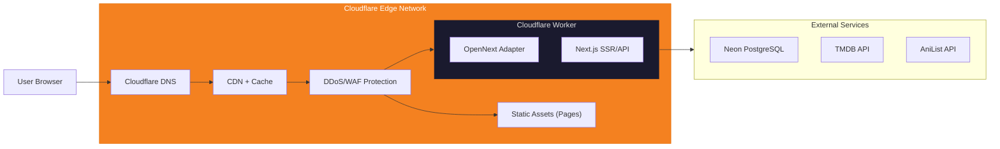

# Monetization & Deployment Strategy — Free Serie Tracker

## Neden Vercel Değil?

| Özellik | Vercel Free (Hobby) | Cloudflare Free |
|---|---|---|
| **Ticari kullanım** | ❌ Yasak | ✅ Serbest |
| **Reklam** | ❌ Yasak | ✅ Serbest |
| **Bandwidth** | 100 GB/ay | **Sınırsız** |
| **Requests** | 100K serverless/ay | 100K workers/gün (günlük!) |
| **CDN** | Vercel Edge | Cloudflare Global (200+ PoP) |
| **DDoS koruması** | Temel | **Enterprise seviye (ücretsiz)** |
| **Custom domain** | ✅ | ✅ |
| **SSL** | ✅ | ✅ |
| **Build minutes** | 6000/ay | 500/ay (yeterli) |

> [!IMPORTANT]
> **Azure Student ($100 kredi)** da ticari kullanım için YASAK. "Education & non-commercial research" şartı var. Reklam geliri alırsan hesap askıya alınabilir.

---

## Deployment: Cloudflare Workers + OpenNext

### Mimari



### Kurulum

```bash
# 1. OpenNext adapter ekle
npm install @opennextjs/cloudflare

# 2. Wrangler (Cloudflare CLI) ekle
npm install -D wrangler

# 3. next.config.ts güncelle
# @opennextjs/cloudflare otomatik configure eder

# 4. wrangler.toml oluştur (proje kökünde)
```

### wrangler.toml

```toml
name = "free-serie-tracker"
compatibility_date = "2026-06-15"
compatibility_flags = ["nodejs_compat"]

# Worker settings
main = ".open-next/worker.js"

# Environment variables (secrets CLI'den eklenir)
# wrangler secret put DATABASE_URL
# wrangler secret put NEXTAUTH_SECRET
# etc.

# Static assets
[assets]
directory = ".open-next/assets"
```

### Deploy Komutu

```bash
# Build + Deploy
npx opennextjs-cloudflare build
npx wrangler deploy

# Veya package.json script olarak
# "deploy": "opennextjs-cloudflare build && wrangler deploy"
```

### CI/CD: GitHub Actions → Cloudflare

```yaml
# .github/workflows/deploy.yml
name: Deploy to Cloudflare
on:
  push:
    branches: [main]

jobs:
  deploy:
    runs-on: ubuntu-latest
    steps:
      - uses: actions/checkout@v4
      - uses: actions/setup-node@v4
        with:
          node-version: 20
      - run: npm ci
      - run: npx opennextjs-cloudflare build
      - uses: cloudflare/wrangler-action@v3
        with:
          apiToken: ${{ secrets.CLOUDFLARE_API_TOKEN }}
          command: deploy
```

---

## Monetizasyon: Google AdSense

### Gelir Modeli

| Gelir Kaynağı | Açıklama |
|---|---|
| **Display Ads (AdSense)** | Banner reklamlar — ana gelir kaynağı |
| **Native Ads** | İçerikle uyumlu reklam kartları |
| **İleride: Affiliate** | Resmi platform linkleri (Netflix, Crunchyroll affiliate) |

### Reklam Yerleşim Stratejisi (UX-First)

> [!WARNING]
> Reklamlar kullanıcı deneyimini BOZMAMALII. Çok fazla reklam = kullanıcı kaybı = gelir kaybı.

```
┌────────────────────────────────────────────────┐
│  Navbar                                        │
├────────────────────────────────────────────────┤
│                                                │
│  [Hero / Trending Section]                     │
│                                                │
├────────── AD SLOT 1 (Leaderboard 728x90) ──────┤  ← Sadece sayfanın ortasında
│                                                │
│  [Content Grid / Series Cards]                 │
│  [Row 1] [Row 2] [Row 3]                      │
│                                                │
│  [Row 4] [AD Card] [Row 5]                    │  ← Native ad (seri kartı gibi)
│                                                │
│  [Row 6] [Row 7] [Row 8]                      │
│                                                │
├────────── AD SLOT 2 (Leaderboard 728x90) ──────┤  ← Sayfanın altında
│                                                │
│  Footer                                        │
└────────────────────────────────────────────────┘
```

### Sayfalara Göre Reklam Planı

| Sayfa | Reklam Sayısı | Yerleşim |
|---|---|---|
| **Ana Sayfa** | 2-3 | 1 leaderboard + 1-2 native card |
| **Keşfet** | 2 | 1 leaderboard + 1 native (grid arasında) |
| **Seri Detay** | 2 | 1 sidebar banner + 1 content arası |
| **Kütüphane** | 1 | 1 leaderboard (alt) — minimal reklam |
| **Login/Register** | 0 | Reklam YOK |

### AdSense Entegrasyonu

```typescript
// src/components/ads/ad-unit.tsx
"use client";

import { useEffect, useRef } from "react";

interface AdUnitProps {
  slot: string;           // AdSense ad unit slot ID
  format?: "auto" | "rectangle" | "horizontal" | "vertical";
  responsive?: boolean;
  className?: string;
}

export function AdUnit({ slot, format = "auto", responsive = true, className }: AdUnitProps) {
  const adRef = useRef<HTMLDivElement>(null);

  useEffect(() => {
    try {
      if (typeof window !== "undefined" && (window as any).adsbygoogle) {
        (window as any).adsbygoogle.push({});
      }
    } catch (error) {
      console.error("AdSense error:", error);
    }
  }, []);

  return (
    <div className={className} ref={adRef}>
      <ins
        className="adsbygoogle"
        style={{ display: "block" }}
        data-ad-client="ca-pub-XXXXXXXXXXXX"   // AdSense publisher ID
        data-ad-slot={slot}
        data-ad-format={format}
        data-full-width-responsive={responsive.toString()}
      />
    </div>
  );
}

// src/components/ads/native-ad-card.tsx
"use client";

/**
 * Grid içinde seri kartları arasına yerleşen "native" reklam.
 * Seri kartıyla aynı boyutta, "Sponsored" etiketi ile belirtilir.
 */
export function NativeAdCard({ slot }: { slot: string }) {
  return (
    <div className="relative rounded-lg overflow-hidden border border-border/50">
      <div className="absolute top-2 right-2 z-10">
        <span className="text-xs text-muted-foreground bg-background/80 px-2 py-0.5 rounded">
          Sponsored
        </span>
      </div>
      <ins
        className="adsbygoogle"
        style={{ display: "block" }}
        data-ad-client="ca-pub-XXXXXXXXXXXX"
        data-ad-slot={slot}
        data-ad-format="fluid"
        data-ad-layout-key="-6t+ed+2i-1n-4w"   // Native layout
      />
    </div>
  );
}
```

### Root Layout'a AdSense Script Ekleme

```typescript
// src/app/layout.tsx
import Script from "next/script";

export default function RootLayout({ children }) {
  return (
    <html>
      <body>
        {children}
        
        {/* Google AdSense - sadece production'da */}
        {process.env.NODE_ENV === "production" && (
          <Script
            async
            src="https://pagead2.googlesyndication.com/pagead/js/adsbygoogle.js?client=ca-pub-XXXXXXXXXXXX"
            strategy="afterInteractive"
            crossOrigin="anonymous"
          />
        )}
      </body>
    </html>
  );
}
```

### ads.txt Dosyası

```
# public/ads.txt
# Google AdSense yetkilendirme
google.com, pub-XXXXXXXXXXXX, DIRECT, f08c47fec0942fa0
```

---

## Domain Stratejisi

### Başlangıç (Ücretsiz)

Cloudflare Workers otomatik subdomain verir:
- `free-serie-tracker.<account>.workers.dev`

### GitHub Student Pack ile Free Domain

1. [GitHub Education](https://education.github.com/pack) başvurusu yap
2. Name.com'dan 1 yıl ücretsiz `.dev` veya `.com` domain al
3. Cloudflare DNS'e bağla (nameserver değiştir)
4. Cloudflare Workers'a custom domain ekle

**Önerilen domain isimleri:**
- `freeserietracker.com`
- `serietracker.dev`
- `trackfree.dev`

### Domain Yenileme Planı

- 1. yıl: Ücretsiz (Student Pack)
- 2. yıl+: ~$10-12/yıl (reklam geliri bunu karşılar)

---

## Maliyet Tablosu

### Başlangıç (Ay 0-6)

| Hizmet | Aylık Maliyet |
|---|---|
| Cloudflare Workers + Pages | **$0** (free tier) |
| Neon PostgreSQL | **$0** (free tier: 0.5 GB) |
| Domain (Student Pack) | **$0** (1 yıl) |
| GitHub Private Repo | **$0** |
| TMDB API | **$0** |
| AniList / MangaDex / Jikan | **$0** |
| Google AdSense | **$0** (komisyon zaten alır) |
| **TOPLAM** | **$0/ay** |

### Büyüme Sonrası (Opsiyonel)

| Hizmet | Aylık Maliyet | Tetikleyici |
|---|---|---|
| Cloudflare Workers Paid | $5/ay | 100K+ req/gün aşılırsa |
| Neon PostgreSQL Pro | $19/ay | 0.5 GB storage dolunca |
| Domain yenileme | ~$1/ay | 2. yıl |
| Upstash Redis | $0 (free tier) | Rate limiting gerekirse |

---

## Cloudflare'ın Ek Avantajları (Ücretsiz)

| Özellik | Açıklama |
|---|---|
| **DDoS Protection** | Enterprise seviye, otomatik |
| **Web Application Firewall** | SQL injection, XSS koruması |
| **Bot Protection** | Otomatik bot filtreleme |
| **Analytics** | Temel trafik analitiği |
| **DNS** | En hızlı DNS sağlayıcısı |
| **SSL/TLS** | Otomatik, full strict mode |
| **Image Optimization** | Cloudflare Images (sınırlı free) |
| **Rate Limiting** | Temel seviye ücretsiz |

Bu özellikler Vercel'de ya yoktu ya da ücretliydi.
